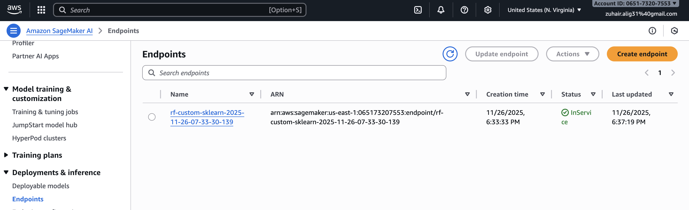

# End-to-End Machine Learning with AWS SageMaker 🚀

## Overview
This project demonstrates an end-to-end Machine Learning lifecycle on the Cloud using AWS SageMaker. I took a Mobile Price Classification dataset, processed it locally, trained a model on a SageMaker EC2 instance using custom scripts, and deployed it to a live endpoint for inference.

## Architecture
1.  **Ingestion:** Data is processed locally using Pandas and uploaded to **AWS S3**.
2.  **Training:** A custom **Scikit-Learn** script is sent to SageMaker, which spins up an `ml.m4.xlarge` instance to train the Random Forest model.
3.  **Deployment:** The trained model artifact is deployed to an HTTPS endpoint for real-time predictions.

## Tech Stack
*   **Cloud:** AWS SageMaker, S3, EC2, IAM
*   **Language:** Python 3.8
*   **Libraries:** Scikit-Learn, Pandas, Boto3, SageMaker SDK

## Proof of Deployment

## How to Run
1.  Configure AWS CLI with `aws configure`.
2.  Install requirements: `pip install -r requirements.txt`.
3.  Run the `main.ipynb` notebook.